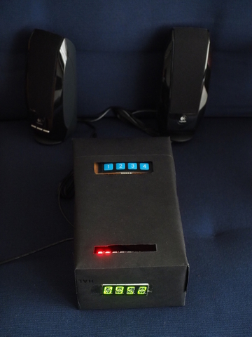

nerd-alarmclock
===============

A Pi-Zero W based alarm-clock for nerds with many unique functions:

 - wake-up light (using Pimoroni's *Blinkt!*)
 - clock display (using Pimoroni's *Four Letter pHat*)
 - play sounds or internet radio
 - use a chat-bot for configuration

See the alarm-clock in a prototype housing: .

Table of Contents
-----------------

  1. [News and Status](#news "News")
  2. [Installation](#install "Installation")
  3. [Hardware](#hardware "Hardware")
  4. [Prerequisites](#prerequisites "Prerequisites")
  5. [Configuration](#configuration "Configuration")
  6. [Usage](#usage "Usage")
  7. [Hacking](#Hacking "Hacking")

News
----

As always, the software and documentation is work in progress.
A detailed list of functions (current and planned) is available in the
document [Features](doc/features.md "Features"). Nevertheless, once in a
while I will release a stable version.

Available branches:

  - **stable_v?**: stable versions (frozen)
  - **master**: the current stable branch plus fixes
  - **next**: the bleeding-edge development version with new features, but
              possibly unstable

### next / work in progress ###

Besides fixing some minor bugs, this version adds the following features:

  - control the clock using an IR remote (complete)
  - use the LED-strip as a lamp (work-in-progress)
  - add parameter `delay` to all alarms (e.g. to start the sound later than
    the light) (work-in-progress)
  - Add a web-interface to be independent from telegram (work-in-progress)

Note that you should read the section *Upgrade* below if you are upgrading
from a previous version.

### stable_v2 / Dec 08, 2017 ###

Besides fixing some minor bugs, this version adds the following features:

  - add support for internet-radio
    - play radio independently of alarms
    - two encoder-knobs (KY040) for on/off and volume and for switching
      between channels and channel-lists
  - add support for snoozing alarms
  - added a set of overlay-functions initiated by a long press of button-2:
    - restart the clock
    - reboot the system
    - shutdown the system
  - refactored code for future IR remote control suoport

For details, see [Features](doc/features.md "Features").

Note that you should read the section *Upgrade* below if you are upgrading
from stable_v1.

### stable_v1 /  Sept 14, 2017 ###

First productive version. All basic features working.

Prerequisites
-------------

Besides the hardware-modules listed in section [Hardware](#hardware "Hardware")
and the software-environment described in
[Installation](#install "Installation") there are no special prerequisites
with the exception of a telegram ID and your own telegram-bot.
If you don't want to use telegram you either have to configure the alarms
using ssh, or wait for the yet to come web-interface.

Registering with telegram is easy, just download the messenger and follow
the instructions. After that, start a chat with @BotFather and this chatbot
will lead you through the process of defining your own bot.

Hardware
--------

From hardware-side, you need

  - a Pi with internet access (a Pi-Zero-W will do fine)
  - the [LED-strip *Blinkt!* from Pimoroni](https://shop.pimoroni.com/products/blinkt "Blinkt!")
  - the [segment-display *Four Letter pHat*](https://shop.pimoroni.com/products/four-letter-phat "Four-Letter-pHat")
    from the same manufacturer
  - four to five buttons, e.g. a cheap [4-key keypad](doc/keypad.jpg) available
    from ebay or Amazon marketplace.
  - a real-time-clock (DS3231, optional)
  - jumper cable or an extension board
    (e.g. a [Mini Black HAT Hack3r](https://shop.pimoroni.com/products/mini-black-hat-hack3r "Extension board"))
  - two encoder-knobs (KY040) for controlling the internet-radio (optional)

Since you need the GPIOs for both hardware extensions, you cannot just
plug in the LED-strip or the hat on the Pi. You can either
connect the components using
[some jumper cables](doc/assembly.jpg "Assembly"), or you use an extension board.
When using jumper cables, observe use the pinout provided by
[https://pinout.xyz](https://pinout.xyz "Pinout"). The pins are also
documented [here](doc/pins.md "Pins").

Installation
------------

As a prerequisite, you need a basic install of Raspbian Jessie-Lite or
Stretch-Lite, but note that the latter has problems with the initial
configuration of IR-remotes (an IR configured under Jessie will work fine
with Stretch though).

Use the following commands to install the software:

    git clone https://github.com/bablokb/nerd-alarmclock.git
    cd nerd-alarmclock
    sudo tools/install
    cd ..
    git clone https://github.com/bablokb/gpio-poll-service.git
    cd gpio-poll-service
    sudo tools/install

This will pull-in all dependencies, install the software, create technical
users and do a basic configuration of the system. Since the install command
changes the file `/boot/config.txt`, you need a reboot to activate the changes.

Note that the installation of the gpio-poll-service will ask you to configure
the service (file `/etc/gpio-poll.conf`), but this project already
provides a suitable configuration file.

Upgrade
-------

Before uprading an existing system, you should stop the relevant system
services:

    sudo systemctl stop nerd-alarmclock.service
    sudo systemctl stop gpio-poll.service

Then run a normal install like documented above. After installation, you
should update you existing `/etc/nerd-alarmclock.conf` from the file
`/etc/nerd-alarmclock.conf.nerd-alarmclock` and the file `/etc/gpio-poll.conf`
from the file `/etc/gpio-poll.conf.nerd-alarmclock`.

Configuration
-------------

### System services ###

Edit the file `/etc/nerd-alarmclock.conf` to configure the systemd-service
running the clock. In this file, you at least have to edit the section
`[BOT]` and enter your own user-id and the id of your bot. The latter is
provided by *BotFather*. To query your own id, edit the python-script
`tools/simplebot.py`, start it and exchange some messages with the bot.
The script will print all messages and you will find your own id in the
messages (extract the "from-id").

You should also make sure that the GPIOs configured in `/etc/gpio-poll.conf`
match the GPIOs in the section `[GPIO]` of `/etc/nerd-alarmclock.conf`.

### Bot configuration ###

The bot of the alarmclock uses a predefined set of commands. You should
register the following commands for your bot with *BotFather*:

| Command    | Description                 |
| -----------|-----------------------------|
| `/alarm`   | Configure alarms            |
| `/restart` | Restart the clock           |
| `/reboot`  | Reboot the system           |
| `/shutdown`| Shutdown the system         |
| `/start`   | Start a dialog with the bot |
| `/help`    | Provide help                |
| `/settings`| Show settings               |

This is not strictly necessary, but it greatly simplifies interaction with
the bot.

### IR remote ###

The alarm clock can also be controlled using an IR remote control. First, you
have to install IR support (lirc) and configure your remote. There are
various tutorials on the net, please make sure you follow a version for
the base operating system (configuration of lirc has changed in Stretch
compared to Jessie). After configuration, you should have a lirc-configuration
file which maps IR-pulses to (lirc-) keynames.

Once you have the lirc keynames, you must map the keys using these keynames
to logical functions of the nerd-alarmclock. This is done in the section
`[LIRC]` of `/etc/nerd-alarmclock.conf`. The installation provides a sample
configuration, depending on your remote, you will want to change the
mapping or add additional functions.

A special function is called `LONG` (in the sample mapping assigned to `KEY_0`).
Pressing this key will simulate a long-press for the following key. E.g.
if you press `KEY_0` and then `KEY_1`, this will emulate a long press
of `BTN1` (which in turns activates the first set of overloaded functions for
all keys). Since most remotes have enough keys, this feature is not
really necessary when using a remote control.

### Audio ###

The install script will add a file `/etc/asound.conf` which is suitable for
USB-audio. If you use the pHat-DAC, you should move the file
`/etc/asound.conf.pHatDAC` to `/etc/asound.conf`. Note that the pHat-DAC
uses GPIO19, so you have to reconfigure the default setup of the pins
(edit the files `/etc/nerd-alarmclock.conf`, `/usr/local/sbin/nerd-gpios.sh`
and `/etc/gpio-poll.conf` and reassign the pin for the encoder-knob).

If you want to use Bluetooth-audio, you should head over to the project
[pi-btaudio](https://github.com/bablokb/pi-btaudio "pi-btaudio") and follow
the instructions.

### Adding sounds ###

To play music or sounds during an alarm, you have to add the files
to the directory `/var/lib/nerd-alarmclock/sounds`. The nerd-alarmclock uses
the program `mpg123` to play the files, so all formats supported by mpg123
should be fine. If you want to play an internet-radio station, add the url
to a file with the extension `m3u` (playlist). Note that mpg123 does not
support nested playlists.

### Adding Radio channel-list ###

Since version v2, the nerd-alarmclock supports playing internet-radio.
The distribution supplies some sample channel-lists in the directory
`/var/lib/nerd-alarmclock/channels`. Add your own lists using the
format in the samples.

Pressing one of the encoder-knobs will cycle through the channel lists,
while turning the knob will cycle through the channels of a given list.
The display will show the name of the channel list after a change for a
few seconds. The same holds true for changing channels.

### Manual configuration ###

Program defaults are in the file `/var/lib/nerd-alarmclock/defaults.json`.
You should not edit this file directly (unless you know what you are
doing). After first run, the settings are saved in
`/var/lib/nerd-alarmclock/settings.json`. You can edit this file
manually, but you should make sure the clock-service is stopped before
doing so (it will be otherwise overwritten).

There are still some settings which you typically only change very
seldomly and these settings are not exposed by the config-interface of the
bot, so you have to change the manually:

  - **day.start**: start of day-mode (e.g. brightness depends on this)
  - **day.end**:   end   of day-mode (e.g. brightness depends on this)
  - some special options to tweak the alarms

Usage
-----

After initial configuration as explained above, restart the system and then
it should just run. Use the bot to configure alarms and the buttons to
enable or disable the alarms. See [keyboard usage](doc/keyboard.md
"Keyboard Usage") for details about the behaviour of the buttons.

The two encoder-knobs have builtin switches. One encoder-knob controls
the radio (switch: on/off, dial: volume), the other knob controls the
channels (switch: cycle channel-lists, dial: choose channel).

Hacking
-------

If you want to change the code and adapt it for your needs, you need some
python know-how and you have to understand the structure of the program.
For details read the [hacking-guide](doc/hacking.md "Hacking-Guide").
